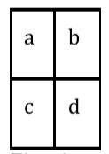

##### Fritz Raluca-Mihaela
##### Artifical Intelligence KR Mini-Project

---

## 1. Problema de cautare (un mesaj…) 

In drum spre scoala un copilas a auzit doi copii mai mari vorbind despre un coleg si prieten bun de-al lui. Cei doi voiau sa-i faca o farsa rautacioasa in prima pauza. Copilasul insa a ajuns dupa ce incepuse ora si a trebuit sa se aseze direct in banca, fara a-si putea avertiza colegul de primejdie. Din fericire i-a venit in minte sa-i trimita din coleg in coleg un bilet cu un mesaj in care sa-l atentioneze despre farsa.  

Copii sunt asezati in banci de cate doua persoane. Bancile sunt dispuse in trei coloane astfel:  

   

Un copil poate da fara probleme biletul catre colegul de banca, la fel neobservat de catre profesor poate da biletul catre colegii din fata sau din spatele lui, insa nu si in diagonala, deoarece, intinzanduse peste banca ar atrage privirea profesorului.    

Considerand fragmentul de clasa de mai jos:  
  

Elevul a poate trimite biletul doar catre b sau c.  

Probleme apar din faptul ca unele locuri in banci pot fi libere, dar si din faptul ca o serie de colegi sunt suparati intre ei si nu-si vorbesc, deci nici nu ar trimite biletul (supararea este reciproca).  

De asemenea, trecerea biletelului de pe un rand pe altul este mai anevoioasa, deoarece poate fi vazut foarte usor de catre profesor, de aceea singurele banci intre care se poate face transferul sunt penultimele si ultimele de pe fiecare rand.  

Copilul vrea sa scrie pe bilet drumul pe care trebuie sa-l parcurga, de la un coleg la altul, pentru a fi sigur ca nu se rataceste prin clasa si nu mai ajunge la prietenul sau pana la inceputul pauzei.   

Se considera prin conventie ca:   
- fiecare copil este identificat unic prin numele sau.  
- niciun copil nu se numeste 'suparati' sau 'liber'   
- locurile libere sunt marcate prin identificatorul 'liber'   

Formatul fisierului de intrare este urmatorul. Pe primele linii din fisier se precizeaza asezarea in banci. Fiecare linie cuprinde 6 nume (numele sunt formate doar din litere). Primii doi identificatori corespund primei coloane de banci, urmatorii doi identificatori coloanei din mijloc, si utltimii doi, ultimei coloane de banci.  

Dupa ce se termina liniile cu asezare in banci, apare un rand cu identificatorul suparati. Sub acest rand, sunt trecuti cate doi elevi (numele lor) care sunt suparati intre ei.    

Exemplu de fisier:   
```markdown
ionel alina teo eliza carmen monica
george diana bob liber nadia mihai
liber costin anda bogdan dora marin
luiza simona dana cristian tamara dragos
mihnea razvan radu patricia gigel elena
liber andrei oana victor liber dorel
viorel alex ela nicoleta maria gabi
suparati
george ionel
ela nicoleta
victor oana
teo eliza
teo luiza
elena dragos
alina dragos
mesaj: ionel -> dragos 
```
Exemplu de drum din fisierul de iesire:  

```markdown
ionel > alina v diana v costin v simona v razvan v andrei >> oana ^ 
radu > patricia v victor v nicoleta >> maria > gabi ^ dorel 
^ elena < gigel ^ tamara > dragos
```

In urma rularii se va afisa drumul parcurs, in ordine cronologica.
Daca biletelul merge in cadrul aceluiasi rand, deci catre un coleg de banca,
in stanga, se va afisa <, daca merge in dreapta, se va afisa >.  

Daca biletelul merge spre spatele clasei, intre copiii care transmit biletul se va afisa un v (pe post de sagetica in jos), iar daca merge spre fata clasei, se va afisa ^ pe post de sagetica in sus.   

Cand biletul se deplaseaza spre stanga de pe un rand de banci pe altul, se va afisa <<, iar spre dreapta: >>.   